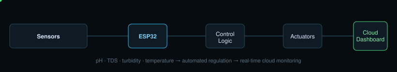
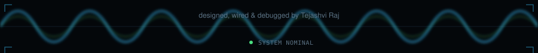

<div align="center">

</div>

<p align="center">
  <a href="https://www.linkedin.com/in/tejashviraj19/"></a>
  <a href="https://github.com/tejashviraj19"></a>
  <a href="https://www.geeksforgeeks.org/user/tejashviraj19/"></a>
</p>


### Engineering Identity

I work at the boundary between silicon and software — designing the PCB, writing the firmware that runs on it, and building the sensor and control logic that turns it into a working product. My focus: **embedded systems, PCB design, sensor integration, and industrial automation.**

```
sensors  →  embedded firmware  →  control logic  →  connected product
```

### Currently Building

**Sensors & Controls Intern · Seisou Labs, Bengaluru** — designing a custom ESP32-based PCB in KiCad with multi-sensor interfaces for temperature, humidity, flow, CO₂, and energy monitoring.


## Featured Projects

### DHARA — The Ultimate Aqua-Hydro Manager
Autonomous monitoring and control system for hydroponic and aquaponic environments.



`ESP32` `Arduino Uno` `C++` `UART` `IoT`
— multi-parameter water sensing (pH · TDS · turbidity · temperature), automated pH regulation with calibration, ESP32↔Arduino UART link, real-time cloud monitoring.

**[View Project](https://www.linkedin.com/in/tejashviraj19/details/projects/)**

<br>

<table>
<tr>
<td width="50%" valign="top">

**Smart Bin — Touchless IoT Dustbin**
ESP32-based smart waste management system.

`ESP32` `Blynk IoT` `C++`
- Touchless lid via ultrasonic sensing
- Real-time fill-level / overflow detection
- Servo-driven mechanical control
- Cloud notifications

**[View Project](https://www.linkedin.com/in/tejashviraj19/details/projects/)**

</td>
<td width="50%" valign="top">

**PCB Design Lab**
Embedded hardware and custom PCB development.

`KiCad` `Schematic Capture` `Routing` `DRC` `Gerber`
- Full schematic → layout workflow
- Component selection & footprint creation
- Placement optimization, DRC verification
- Manufacturing-ready Gerber output

**[View Repository](https://github.com/tejashviraj19/PCB-Design-Lab)**

</td>
</tr>
</table>


## Tech Stack

|  |  |
|---|---|
| **Embedded** | ESP32 · Arduino · Raspberry Pi · Embedded C · C++ |
| **PCB & Electronics** | Altium Designer · KiCad · Altium · LTSpice · Circuit Design · PCB Layout · VLSI Fundamentals |
| **Sensors & Interfaces** | pH · TDS · Turbidity · RTD · Thermocouple · Flow · CO₂ |
| **Communication** | UART · I²C · SPI · Modbus |
| **IoT & Tools** | Blynk · MATLAB / Simulink · Tinkercad · Python · Git / GitHub |


## Engineering Journey

**Sensors & Controls Intern** · Seisou Labs Private Limited
`Bengaluru` · Jul 2026 – Oct 2026
- Designed a custom ESP32-based PCB in KiCad with multi-sensor interfaces for temperature, humidity, flow, CO₂, and energy monitoring — full schematic, routing, DRC, and Gerber generation
- Validated the embedded sensing architecture through sensor calibration, dew-point/MRT calculations, and 60+ hour reliability testing with stable sensor acquisition and Raspberry Pi communication
- Defined the ESP32–Raspberry Pi–PLC control architecture, implementing Wi-Fi/TCP-IP and Modbus RTU (RS485) communication, and developed dashboard/data-logging features alongside a condensation-protection control strategy

**Project Intern** · Shitashii Innovations Private Limited
`IIT Kanpur` · Nov 2025 – Dec 2025
- Contributed to a wearable ECG/EMG monitoring device — embedded hardware, analog signal conditioning, ESP32, Raspberry Pi
- Supported hardware integration, biomedical signal acquisition, and system debugging
- Designed PCB schematics and layouts in KiCad; supported component-level debugging


## GitHub Activity

<div align="center">

</div>

<p align="center"><sub><a href="https://github.com/tejashviraj19?tab=repositories">View live activity on GitHub →</a></sub></p>


## Connect

<p align="center">
  <a href="https://www.linkedin.com/in/tejashviraj19/">LinkedIn</a> ·
  <a href="https://github.com/tejashviraj19">GitHub</a> ·
  <a href="https://www.geeksforgeeks.org/user/tejashviraj19/">GeeksforGeeks</a>
</p>


